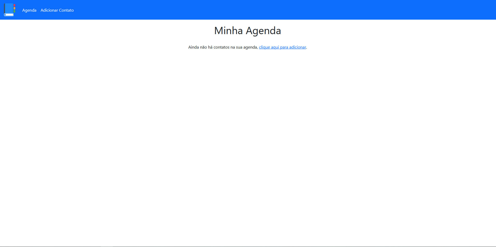
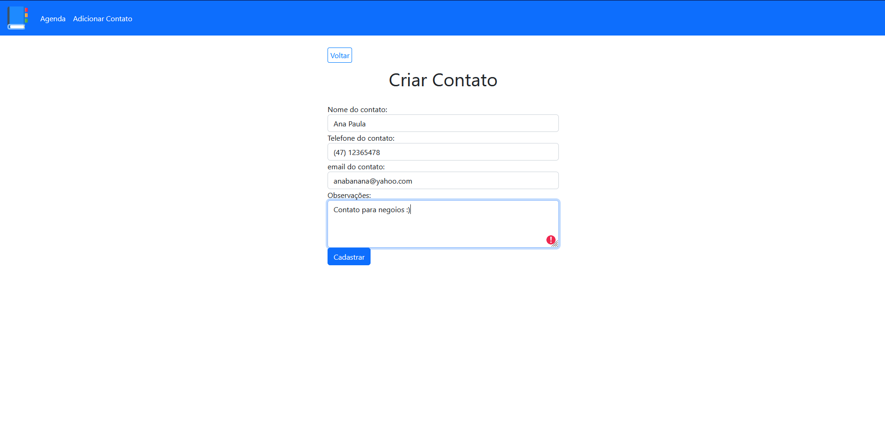

# Teste Back-end - Agenda de contatos

Minha tentativa para a vaga de estagio back-end da empresa Magazord :)

## Tabela de conteudos

- [Overview](#overview)
  - [Descrição](#Descrição)
  - [Screenshot](#screenshot)
- [Meu processo](#meu-processo)
  - [O que eu fiz](#O-que-eu-fiz)
  - [O-que-aprendi](#O-que-aprendi)
- [Author](#author)

## Overview

### Descrição

Dentro da pasta "Projeto-Agenda" você encontrará todos os arquivos necessários para rodar a minha versão do projeto, o qual já adianto que ficou muito diferente do esperado e incompleto :(
Então verá a pasta "Sistema" com todos os arquivos relacionados ao funcionamento do sistema, como a pasta config que contém os arquivos para conexão com banco de dados, validação do metodo "POST" e sua query para a requisição dos dados e mais um arquivo com um link base que foi usado muitas vezes no projeto. Terá tambem a pasta "css" com o arquivo para as estilizações das páginas, pasta "img" armazenando a imagem usada no logo, "templates" com um arquivo para o header e outro com o footer, feito dessa forma para facilitar o processo de desenvolvimento já que eles se repetem em todas as páginas.
Por fim os arquivos das telas do sistema, sendo "index" a home e qual deve ser executado para dar start no mesmo.
Voltando a página raiz terá tambem a pasta "Scripts - Banco de Dados" para criação do database e usuário MySql.

Para executar o sistema os arquivos de "sistema" devem estar em servidor com endereço "Localhost" e os scripts do banco em um SGBD MySql. Então basta buscar no navegador por "localhost/'endereço dos arquivos'".

### Screenshot

## Meu processo

### O que eu fiz

A primeira coisa que se nota é que não atendi a 90% do requisitos, isso aconteceu por conta da minha falta de conhecimento em relação aos metodos e ferramentas requisitados, como por exemplo o Composer, padrão de projeto MVC e POO, sendo esses dois ultimos conhecidos por mim, porém nunca cheguei a me aprofundar de fato e menos ainda a utilizar.
Por essa razão optei por fazer de uma forma que eu soubesse. Acredito que é melhor entregar algo diferente do que não entregar nada.

Já o fato dele estar incompleto - isso me frustra muito - é resultado de eu ter passado a maior parte da semana buscando aprender o temas necessários para atender os requisitos, infelizmente eles são muito densos para se aprender em tão pouco tempo. Por fim acabei ficando sem tempo para terminar o projeto. 

### O que aprendi

O que eu usei no projeto basicamente eu já sabia, então o que aprendi de fato foi que ainda tenho muito a aprender kkk.
Consegui estudar bastante, e vou continuar estudando, os temas como POO, MVC, Composer - já busquei cursos da Udemy sobre o assunto - e por fim pude ver em que nivel meus conhecimentos estão, ainda tenho muito para aprender. E isso apenas me motivou mais ainda a continuar aprendendo programação que eu tanto gosto, inclusive pretendo continuar o projeto, tanto dessa forma como fiz, e novo futuro, como ele deveria ser :)

## Author
- Linkedin - [Ruan Pereira](https://www.linkedin.com/in/ruan-pereira-651523237/)